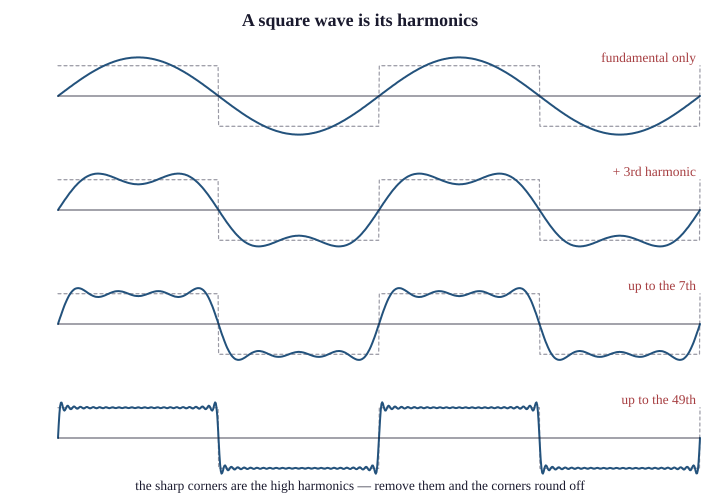

# 5.2 The Frequency Domain

Fourier's claim, rejected by Lagrange in 1807 and published only in 1822, is this:

> Any reasonable periodic function can be written as a sum of sinusoids at
> integer multiples of a fundamental frequency, each with its own amplitude and
> phase.

"Reasonable" is doing some work — Lagrange's objection concerned discontinuities,
and the precise conditions took another century to pin down — but for every signal
in this book the claim holds, and it gives us a second way to describe any signal.

## Two descriptions of one thing

A signal can be described by **what it does over time**, which is what an
oscilloscope shows, or by **how much energy it contains at each frequency**, which
is what a spectrum analyser shows.

These contain identical information. The Fourier transform converts between them
losslessly in both directions; nothing is added and nothing is lost. But they make
different facts obvious, and nearly every fact a network engineer needs is obvious
only in the second.

That is a strong claim, so here is the demonstration.

## The square wave, decomposed

Take a square wave alternating between +1 and −1 at frequency *f*. Its Fourier
series is

$$s(t) = \frac{4}{\pi}\left(\sin(2\pi f t) + \frac{1}{3}\sin(6\pi f t) + \frac{1}{5}\sin(10\pi f t) + \frac{1}{7}\sin(14\pi f t) + \cdots\right)$$

— the fundamental at *f*, plus **odd harmonics** at 3*f*, 5*f*, 7*f* and so on,
each with amplitude 1/*n*.

Build it up term by term and watch what happens:

| Terms included | Result |
|---|---|
| Fundamental only | A pure sine wave. Rounded, no corners at all. |
| + 3rd harmonic | Flatter tops, still rounded corners |
| + 5th, 7th | Recognisably square, corners still soft |
| + up to 15th | Sharp corners, slight ringing at the edges |
| All of them | A perfect square wave |

{width=88%}

The lesson, and it is the chapter's central one:

> **The sharp corners *are* the high harmonics.** They are not a separate feature
> that the harmonics happen to accompany. Remove the high harmonics and you have
> removed the corners, necessarily and exactly.

## Now the channel

A cable, as Chapter 6 §6.1 develops, attenuates high frequencies more than low
ones. That is a statement about frequency response, and it is easy to measure and
easy to state: so many dB of loss at 1 MHz, so many more at 100 MHz.

Send a square wave down such a cable. The fundamental arrives nearly intact. The
3rd harmonic arrives attenuated. The 15th arrives barely at all. What emerges is
the sum of what survived — which is a square wave built from too few terms, which
is to say **a square wave with rounded corners**.

In the time domain this is a mysterious smearing that requires explanation. In the
frequency domain it is a subtraction, and you can predict its magnitude from the
cable's published attenuation curve before laying a metre of it.

This is the pattern for the whole unit:

| Phenomenon | Time-domain view | Frequency-domain view |
|---|---|---|
| Cable rounding a signal | Mysterious smearing | High harmonics attenuated |
| Distortion | Shape changes | Frequency response is not flat |
| Dispersion | Pulse spreads | Different frequencies travel at different speeds |
| Filtering | Some features vanish | A band is removed |
| Intersymbol interference | Symbols overlap | Insufficient bandwidth for the symbol rate |
| A channel's "bandwidth" | (no meaning) | The width of the band it passes |

The right-hand column is where the answers are.

## Spectra of things you will meet

**A pure sine wave** is a single vertical line at its frequency. Nothing else. This
is why a carrier (Chapter 8) occupies almost no bandwidth until you modulate it,
and why an unmodulated interfering transmitter appears on a spectrum analyser as a
narrow spike.

**A square wave** at frequency *f* is a line at *f*, one a third as tall at 3*f*,
one a fifth as tall at 5*f*, and so on — a picket fence of decreasing height,
extending in principle to infinity.

**A single isolated pulse** — not periodic — has a *continuous* spectrum rather
than discrete lines, and the shorter the pulse the wider the spectrum. This is
worth internalising because it has a sharp practical consequence: **fast edges
occupy wide bandwidth**. A digital system that switches quickly radiates and is
susceptible across a wide band, which is why fast circuits need careful shielding
and why deliberately slowing edges is a standard EMC technique.

**Random noise** — thermal noise from Chapter 4 §4.3 — has a flat spectrum. Equal
power at every frequency, which is why it is called *white* noise by analogy with
white light. That flatness is why noise power is proportional to bandwidth: a
receiver that listens to twice as much spectrum hears twice as much noise.

**Human speech** occupies roughly 100 Hz to 8 kHz, with most of the energy and
most of the intelligibility between 300 Hz and 3.4 kHz. That measurement is why
the telephone network chose the band it did, and Chapter 12 traces what followed.

## What a filter is

A **filter** is a device whose frequency response is deliberately not flat.

- A **low-pass** filter passes frequencies below a cutoff and attenuates above.
- A **high-pass** filter does the reverse.
- A **band-pass** filter passes a range and rejects everything outside it.
- A **band-stop** or notch filter rejects a range and passes the rest.

A cable is, incidentally and unintentionally, a low-pass filter. So is any
capacitance to ground. So is the parasitic inductance of a connector. Much of
high-speed design consists of noticing that some component you did not think of as
a filter is behaving as one.

Filters are also used deliberately and constantly: the anti-aliasing filter before
every analog-to-digital converter (Chapter 4 §4.2), the channel filter in every
radio receiver that rejects everything but the wanted band, the splitter that
separates voice from data on a DSL line (Chapter 49 §49.1), and the wavelength
filters that separate DWDM channels (Chapter 50 §50.3).

Every one of them is described by a frequency response, and every one is
incomprehensible in the time domain.

## The tool that made this practical

One historical note, because it explains why the frequency domain is now
ubiquitous rather than merely correct.

Computing a Fourier transform of *N* samples naively takes on the order of *N*²
operations. For a thousand samples that is a million operations, which was
prohibitive on any machine before about 1970.

In 1965 James Cooley and John Tukey — the same Tukey who named the bit, Chapter 2's
notes — published an algorithm doing it in *N* log *N*. For a thousand samples that
is about ten thousand operations: a hundredfold improvement, and it grows with *N*.
The **Fast Fourier Transform** made spectral analysis a routine operation rather
than a research project, and essentially every device in this book — every modem,
every OFDM radio (Chapter 8 §8.4), every spectrum analyser, every DSL line card —
contains an implementation of it running continuously.

(The algorithm turned out to have been known to Gauss in 1805 and never published.
This is not unusual.)
