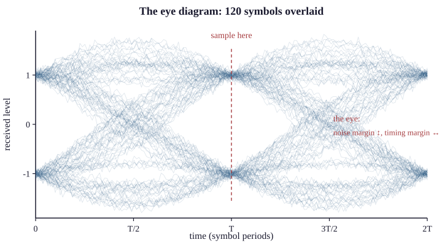

# 6.3 Distortion and Dispersion

Attenuation makes the signal smaller and noise adds to it. Distortion does neither:
it changes the signal's **shape**, without adding anything and without necessarily
reducing its total energy.

This is the impairment that killed the 1858 Atlantic cable, and it is still the
limiting factor at the high end of every medium in this book.

## Two kinds of distortion

**Amplitude distortion** is a frequency response that is not flat: some frequency
components are attenuated more than others. §6.1 showed that copper does exactly
this, and §5.2 showed the consequence — the harmonics that constitute a square
wave's corners are removed, so the corners round off.

**Delay distortion** — also called phase distortion — is different and less
intuitive. Different frequency components travel at **different speeds**, so they
arrive at different times. A pulse launched with all its components aligned arrives
with them spread out, and the pulse is wider than it started.

Both reshape the signal. The second is the one that limits high-speed systems,
because it does not merely soften the signal — it makes each symbol spill into its
neighbours' time slots.

## Intersymbol interference, properly

Consider a pulse representing one symbol. In an ideal channel it occupies exactly
one symbol period. In a real channel it spreads, and its tail extends into the
following symbol period. The receiver, sampling in the middle of symbol *n+1*, sees
symbol *n+1* plus a contribution from symbol *n*, plus perhaps a smaller one from
*n−1*.

That contamination is **intersymbol interference**. It is not noise — nothing was
added from outside — and yet it corrupts decisions in exactly the same way, because
what the receiver measures is no longer determined solely by the symbol it is
trying to read.

The consequence is a hard trade:

> **The faster you signal, the shorter each symbol period, and the more of the
> pulse's spread lands in the next slot.** A channel's dispersion therefore sets a
> maximum symbol rate directly.

This is Nyquist's limit from Chapter 4 §4.2, arrived at from the other direction.
Nyquist stated it as a bandwidth constraint; here it is the same constraint
expressed as time-domain smearing. The two views are the same fact — a channel that
attenuates high frequencies is a channel that spreads pulses — and Fourier's
transform is what converts between the descriptions.

Thomson's law of squares (1855) was the first quantitative statement of this: on a
capacitive cable, signalling speed falls as the *square* of length. Whitehouse's
two thousand volts made the smeared pulses taller and no narrower, which is why
the fix was a sensitive receiver and a slower rate rather than a bigger battery.

## Dispersion in fibre

Optical fibre has three distinct mechanisms, and knowing which one binds determines
what you can do about it.

**Modal dispersion** applies only to multimode fibre. A wide core supports many
propagation paths — modes — of different geometric lengths. Light entering
together arrives spread out, and the spread is proportional to distance.

This is the dominant limit on multimode reach and it is why the OM grades exist:

| Grade | Core | 10 Gb/s reach |
|---|---|---|
| OM1 | 62.5 µm | 33 m |
| OM2 | 50 µm | 82 m |
| OM3 | 50 µm, laser-optimised | 300 m |
| OM4 | 50 µm, laser-optimised | 400 m |
| OM5 | 50 µm, wideband | 400 m + SWDM |

Note that the improvement from OM1 to OM4 is more than tenfold in reach with the
same 10 Gb/s rate, achieved entirely by controlling the refractive index profile so
that the different modes travel at more nearly equal speeds. **Single-mode fibre
eliminates modal dispersion entirely** by making the core narrow enough (about
9 µm) that only one mode propagates, which is why it is the long-haul choice.

**Chromatic dispersion** applies to all fibre. The refractive index depends on
wavelength, so different wavelengths travel at different speeds. A real source is
never perfectly monochromatic — a laser has a linewidth, and modulating it broadens
the spectrum further — so a pulse contains a range of wavelengths that arrive at
slightly different times.

Standard single-mode fibre has near-zero chromatic dispersion at **1310 nm**, which
is why that window exists despite having higher loss than 1550 nm. At 1550 nm the
dispersion is about 17 ps/(nm·km), which over 80 km with a 0.1 nm source gives
136 ps of spread — significant at 10 Gb/s, where a bit is 100 ps.

The remedies, in historical order: **dispersion-shifted fibre** (moving the zero to
1550 nm — which turned out to cause nonlinear problems in DWDM and is no longer
favoured), **dispersion compensating modules** (a spool of fibre with the opposite
dispersion, inserted periodically), and — since about 2008 — **electronic
compensation in a coherent receiver**, which Chapter 50 §50.3 identifies as the
change that transformed long-haul economics.

**Polarisation mode dispersion** is the residual: real fibre is not perfectly
circular, so the two polarisation states travel at slightly different speeds. It is
small, it varies with temperature and mechanical stress, and it becomes a limiting
factor only at very high rates over very long distances. It is also statistical
rather than deterministic, which makes it awkward to compensate.

## The eye diagram

The standard measurement for all of this, and the most informative single picture
in high-speed signalling.

Take the received signal and overlay every symbol period on the same axes,
triggered on the clock. Hundreds or thousands of symbols superimposed produce a
pattern with an opening in the middle that looks like an eye.

```
     ╱‾‾‾‾‾‾╲          ╱‾‾‾‾‾‾╲
    ╱        ╲        ╱        ╲
   ╱          ╲      ╱          ╲       ← the "1" traces
  │      ┌─────────────────┐     │
  │      │   eye opening   │     │      ← sample HERE
  │      └─────────────────┘     │
   ╲          ╱      ╲          ╱       ← the "0" traces
    ╲        ╱        ╲        ╱
     ╲______╱          ╲______╱
     ↑                              ↑
     jitter here                    jitter here
```

Read it as follows:

| Feature | What it measures |
|---|---|
| **Vertical opening** | Noise margin — how much noise before a decision flips |
| **Horizontal opening** | Timing margin — how much jitter before you sample the wrong symbol |
| **Thickness of the traces** | Noise and amplitude variation |
| **Width of the crossings** | Jitter |
| **Asymmetry** | Duty cycle distortion, or a DC offset |

{width=90%}

A wide-open eye is a healthy link. As distortion, dispersion, noise and jitter
accumulate, **the eye closes**, and when it closes past the point where a decision
can be made reliably, the link fails — abruptly, per Chapter 5 §5.1's threshold
behaviour.

The eye diagram is therefore the direct visualisation of that threshold. It is
also, usefully, diagnostic about *which* impairment is present: vertical closure
implicates noise and attenuation, horizontal closure implicates jitter and
dispersion, and asymmetry implicates the transmitter.

## Equalisation: fighting back

If distortion is a known frequency response, you can apply its inverse. That is
**equalisation**, and modern high-speed links are full of it.

- **Fixed equalisation** applies a preset inverse response, adequate when the
  channel is known and stable.
- **Adaptive equalisation** measures the channel — typically from a training
  sequence — and adjusts continuously. Every DSL modem, every 10GBASE-T
  transceiver and every coherent optical receiver does this.
- **Decision feedback equalisation** uses the decisions already made about previous
  symbols to subtract their known contribution from the current one. Powerful, and
  it has the property that a wrong decision propagates briefly.

Equalisation is why Cat5e, specified in 1999 to 100 MHz, carries 2.5 Gb/s under
802.3bz (2016). The cable did not change. The transceiver's ability to measure and
invert the cable's distortion did, and Chapter 10's observation that a medium's
properties are a function of the current manufacturing art is exactly this.

## What breaks here

**A link that works at a lower rate and fails at a higher one.** Dispersion sets a
symbol rate limit; raising the rate crosses it. The most common presentation is a
transceiver upgrade on an unchanged fibre.

**Multimode fibre used beyond its OM grade's reach.** The link may come up and
show errors under load. Check the grade printed on the jacket against the
standard's table.

**A 1550 nm system over a long span with no dispersion compensation.** Works at
1 Gb/s, fails at 10.

**An eye that is open on the bench and closed in service.** Temperature. Copper's
loss and fibre's PMD both vary with it, and a riser in summer is a different
channel from a riser in winter.

> **Network+ note.** N10-009 expects the multimode/single-mode distinction and
> the reason multimode is distance-limited (objective 1.5), and expects
> attenuation and interference as cable fault causes (objective 5.2). Modal
> dispersion is the mechanism behind the first; this section is where the "why"
> lives.
