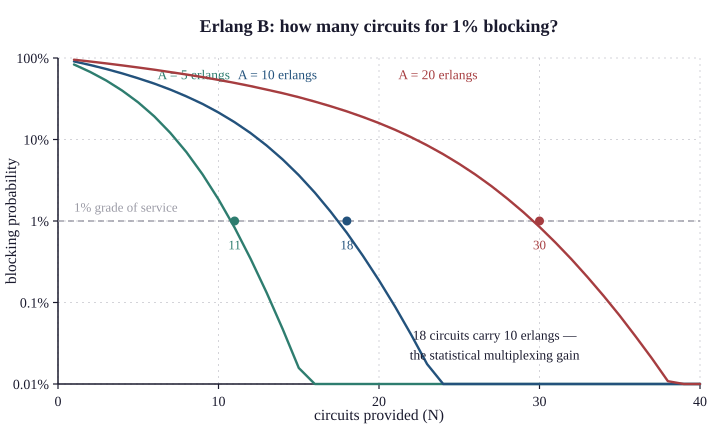

# 12.4 Erlangs and Blocking

Agner Krarup Erlang worked for the Copenhagen Telephone Company, and around 1909 he
was asked a question his employer actually had: **how many circuits does an exchange
need?**

The answer is not "one per subscriber", and working out how many fewer required him
to invent queueing theory. The mathematics he produced is still used to size trunk
groups, call centres, and — with different names on the variables — a great deal of
modern capacity planning.

## The unit

The **erlang** measures **offered traffic**: the average number of circuits in
simultaneous use.

$$A = \frac{\lambda \times h}{3600}$$

where λ is calls per hour and *h* is mean holding time in seconds. Equivalently, one
erlang is one circuit occupied continuously for the measurement period.

Worked: 180 calls per hour, averaging 200 seconds each.

$$A = \frac{180 \times 200}{3600} = 10 \ \text{erlangs}$$

Ten circuits are in use on average. The question is how many you must **provide**,
and the answer is more than ten — because traffic is random and there will be
moments when more than ten calls are in progress.

## Erlang B

The standard formula for a **lost-calls-cleared** system: a caller who finds all
circuits busy is refused and goes away. This is what a trunk group does, and the
busy signal is the refusal.

$$B(N, A) = \frac{A^N / N!}{\sum_{k=0}^{N} A^k / k!}$$

*B* is the **blocking probability** — the fraction of calls refused — with *N*
circuits carrying *A* erlangs of offered traffic.

The formula is not pleasant to evaluate by hand, and there is a recurrence that is:

$$B(0, A) = 1, \qquad B(n, A) = \frac{A \cdot B(n-1, A)}{n + A \cdot B(n-1, A)}$$

{width=85%}

Iterate up from *n* = 0 and you have it in a few lines of arithmetic or three lines
of code.

## What the numbers show

For 10 erlangs of offered traffic:

| Circuits | Blocking | Comment |
|---|---|---|
| 10 | 21.5% | One call in five refused |
| 12 | 11.6% | |
| 14 | 5.7% | |
| 15 | 3.6% | |
| 16 | 2.2% | |
| **18** | **0.7%** | Typical grade of service |
| 20 | 0.19% | |
| 25 | 0.005% | Diminishing returns |

Two observations, and both matter.

**Eighteen circuits carry ten erlangs at better than 1% blocking.** Not the hundreds
of subscribers who might call — eighteen. This is the same statistical multiplexing
argument as Chapter 9 §9.3, arrived at seventy years earlier for a different
resource, and it is why telephone networks were affordable at all.

**The returns diminish sharply.** Going from 14 to 18 circuits — 29% more capacity —
takes blocking from 5.7% to 0.7%, an eightfold improvement. Going from 18 to 25 —
39% more capacity — takes it to 0.005%, which nobody notices. The knee is around
1%, and that is not a coincidence: **grade of service targets are chosen where the
curve bends**, because beyond it you are paying substantially for improvements
customers cannot perceive.

## Trunking efficiency

The property that makes aggregation valuable, and the one that surprises people.

| Offered traffic | Circuits for 1% blocking | Utilisation |
|---|---|---|
| 1 erlang | 5 | 20% |
| 5 erlangs | 11 | 45% |
| 10 erlangs | 18 | 56% |
| 20 erlangs | 30 | 67% |
| 50 erlangs | 64 | 78% |
| 100 erlangs | 117 | **85%** |
| 500 erlangs | 537 | 93% |

**Larger trunk groups are dramatically more efficient at the same grade of
service.** One erlang needs five circuits and achieves 20% utilisation; a hundred
erlangs needs 117 and achieves 85%.

The reason is Chapter 9 §9.3's: the mean grows as *n* and the standard deviation as
√*n*, so relative variability falls and less headroom is needed.

The engineering consequence is that **combining small trunk groups is worth real
money.** Two separate 10-erlang groups need 18 circuits each — 36 in total. One
combined 20-erlang group needs 30. Six circuits saved, at the same grade of service,
for no other change.

This is why exchange hierarchies aggregate (§12.1), why carriers consolidate, and —
in the modern form — why cloud providers are cheaper per unit of compute than
running your own. It is the same mathematics.

## Erlang C, and where it went

**Erlang B** assumes blocked calls are cleared. **Erlang C** assumes they **queue**
— which is the wrong model for a trunk group and the right one for a call centre,
where a caller who finds all agents busy waits on hold.

Erlang C is what workforce management systems in contact centres run, and it answers
"how many agents for a target answer time" rather than "how many circuits for a
target blocking rate". If you have ever been told "your call is important to us,
you are number seven in the queue", an Erlang C calculation determined how many
agents were rostered.

The same mathematics also describes:

- **Web server pools** — how many workers before requests queue.
- **Database connection pools.**
- **Checkout lanes, hospital beds and lifts**, all of which are queueing problems
  with the same structure.

## Applying it now

Erlang's model assumes Poisson arrivals, exponential holding times, and infinite
sources. Real traffic is burstier and more correlated than that, so the model is
optimistic — but the *shape* is right and the practice endures.

Two modern applications worth knowing:

**VoIP trunk sizing.** A SIP trunk with *N* concurrent call paths is a trunk group,
and Erlang B sizes it exactly as it sized a T1's channels. Compute the erlangs from
call volume and duration, choose a grade of service, read off the paths, then
multiply by the codec's bandwidth **including all headers** (Chapter 3 §3.1's
arithmetic — 87.2 kb/s for G.711 over Ethernet, not 64).

**Contact centre staffing**, via Erlang C.

And a broader observation: **Erlang's framework includes admission control, and
packet networks do not.** A trunk group refuses the 19th call and the other 18 are
unaffected. A packet network accepts everything and degrades everyone — which
Chapter 13 §13.4 identifies as the property the industry most regrets giving up, and
which QoS (Chapter 52) and 5G network slicing (Chapter 46 §46.4) are attempts to
partially recover.

## What breaks here

**Sizing from the average.** Ten erlangs needs eighteen circuits, not ten.
Provisioning to the mean gives 21.5% blocking, which is a badly broken service.

**Sizing without a stated grade of service.** "How many circuits" is unanswerable
without "at what blocking probability", and the answer varies by a factor of two
across the plausible range.

**Ignoring the busy hour.** Erlang calculations use the **busy-hour** traffic, not
the daily average. A group sized on daily average traffic blocks heavily at 10 a.m.

**Splitting trunk groups unnecessarily.** Two 10-erlang groups need 36 circuits;
one 20-erlang group needs 30. Splitting for administrative convenience costs
capacity, and it is a common and invisible waste.

**Applying Erlang B to a queueing system.** A call centre where callers wait is
Erlang C, and using B will under-staff it substantially.

> **Network+ note.** Erlang is not on N10-009. The concept behind it is examined
> repeatedly under a different name: **oversubscription**. Every access network,
> every ISP uplink and every wireless cell is oversubscribed deliberately, sized on
> aggregate rather than on the sum of peaks, and Erlang's mathematics is why that is
> sound engineering rather than corner-cutting.
