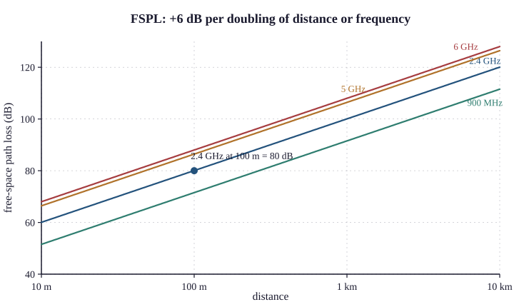
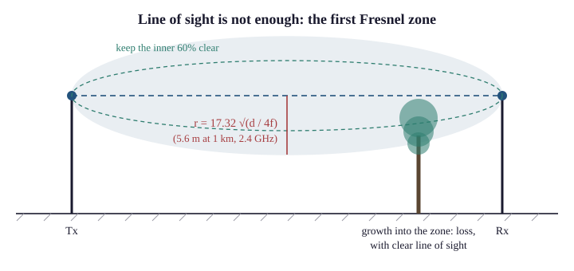

# 42.3 Path Loss and the Link Budget

A link budget is the accounting that determines whether a radio link will work. It is
addition and subtraction in decibels, it takes five minutes, and doing it before
installing anything is the difference between engineering and hoping.

## Free-space path loss

Even with nothing in the way, a signal weakens with distance — because the energy
spreads over the surface of an expanding sphere.

$$\text{FSPL (dB)} = 20\log_{10}(d) + 20\log_{10}(f) + 32.44$$

with **d in kilometres** and **f in MHz**.

The two `20 log` terms are the whole content:

> **Doubling the distance costs 6 dB. Doubling the frequency costs 6 dB.**

Because 20 log₁₀(2) = 6.02 — and this pair of facts lets you estimate any link in your
head.

### Worked

**At 2.4 GHz:**

| Distance | FSPL |
|---|---|
| 10 m | 60 dB |
| 100 m | **80 dB** |
| 1 km | **100 dB** |
| 10 km | 120 dB |

Each ten-fold increase in distance costs 20 dB, which follows from the same logarithm.

**At 100 m, comparing bands:**

| Frequency | FSPL at 100 m |
|---|---|
| 900 MHz | **71.5 dB** |
| 2.4 GHz | **80.0 dB** |
| 5 GHz | **86.4 dB** |
| 6 GHz | 88.0 dB |

5 GHz starts 6.4 dB behind 2.4 GHz before anything is in the way — a factor of about
4.4 in power, from the frequency alone.

{width=85%}

Add the higher absorption of §42.1's material table and the practical range difference
is larger still, which is why a dual-band deployment has smaller 5 GHz cells than 2.4 GHz
ones and why Chapter 45 §45.1 designs for the 5 GHz coverage rather than the 2.4.

## The full budget

Everything that adds or subtracts, in one column:

```
   TRANSMIT SIDE
     Transmitter power                    +20 dBm
     Cable and connector loss              −2 dB
     Antenna gain                         +12 dBi
     ────────────────────────────────────────────
     EIRP                                 +30 dBm

   THE PATH
     Free-space path loss (2.4 GHz, 1 km) −100 dB
     Obstruction / foliage / rain          −10 dB
     Fade margin (reserve)                 −15 dB
     ────────────────────────────────────────────

   RECEIVE SIDE
     Antenna gain                         +12 dBi
     Cable and connector loss              −2 dB
     ────────────────────────────────────────────
     RECEIVED SIGNAL                      −85 dBm

     Receiver sensitivity at this rate    −89 dBm
     ────────────────────────────────────────────
     MARGIN                                +4 dB   ← it works, barely
```

The link works if the received signal exceeds the receiver's sensitivity, and the
margin is what you have left over.

### Receiver sensitivity

The weakest signal a receiver can decode, and it depends on the data rate:

| Rate | Typical sensitivity |
|---|---|
| 1 Mb/s (802.11b) | **−98 dBm** |
| 6 Mb/s | −92 dBm |
| 54 Mb/s | −79 dBm |
| **MCS 7 (65 Mb/s)** | **−73 dBm** |
| **MCS 9 (780 Mb/s, 80 MHz)** | **−59 dBm** |

> A weak link does not fail. It slows down, by falling back to a more robust
> modulation.

Which is why "it connects but it is slow" is the characteristic wireless complaint, and
why rate is a better coverage measurement than association.

**And it explains a design consequence:** if you design for the lowest rate, you get large
cells full of slow clients; if you design for a high rate, you get small cells and high
throughput. Chapter 45 §45.3 is that decision.

## Fade margin

The reserve for variation, and omitting it is the commonest link-budget error.

A link with zero margin works in the conditions you measured and fails in every other
condition — and conditions vary:

| Cause | Typical |
|---|---|
| **Rain** (above ~10 GHz) | 5–20 dB |
| **Foliage**, seasonal | 5–15 dB |
| **Multipath fading** (§42.4) | **10–30 dB, momentarily** |
| Temperature and humidity | 1–3 dB |
| Equipment ageing, connector degradation | 1–3 dB |

**The conventional reserves:**

| Link | Fade margin |
|---|---|
| Short indoor | **10 dB** |
| Outdoor point-to-point | **20 dB** |
| Long-haul or carrier-grade | **25–30 dB** |

> A link with 3 dB of margin is not a working link. It is a link that happens to be
> working.

The first rainstorm, the first summer's foliage, or a passing vehicle will take it down,
and the failure will appear intermittent and unexplained.

## Doing it in your head

**The estimation technique**, and it is accurate enough for a first pass:

**1. Start with EIRP.** Transmit power plus antenna gain, minus cable.

2. Path loss at 2.4 GHz, from the anchors:

| Distance | Loss |
|---|---|
| 100 m | **80 dB** |
| 1 km | **100 dB** |
| 10 km | 120 dB |

**Interpolate at 6 dB per doubling.**

3. Add 6 dB if 5 GHz. Subtract 8 dB if 900 MHz.

**4. Subtract obstructions** — §42.1's table, roughly.

**5. Add the receive antenna gain.**

6. Compare with sensitivity, and demand 20 dB of margin outdoors.

**Worked, quickly:** *"Will a 2.4 GHz link work over 500 m with 12 dBi panels at each end
and 20 dBm radios?"*

```
   EIRP:        20 + 12 = 32 dBm
   FSPL 500 m:  100 dB (at 1 km) − 6 dB (half the distance) = 94 dB
   Received:    32 − 94 + 12 = −50 dBm
   Sensitivity: −79 dBm at 54 Mb/s
   Margin:      29 dB
```

**Comfortable.** And the arithmetic took twenty seconds.

## The Fresnel zone

Line of sight is necessary and not sufficient, and this is the part most often
overlooked.

A radio wave does not travel in an infinitely thin line. It occupies an ellipsoid
between the antennas, and obstructing that volume attenuates the signal even when the
direct path is clear.

```
        ╭───────────────────────────╮
   Tx ──┤ ░░░░░░ Fresnel zone ░░░░░ ├── Rx
        ╰───────────────────────────╯
                    ▲
              obstruction here
              causes loss, even
              though you can see
              from Tx to Rx
```

The first Fresnel zone's radius at the midpoint:

$$r = 17.32 \sqrt{\frac{d}{4f}}$$

with r in metres, d in kilometres, f in GHz.

**Worked at 2.4 GHz:**

| Link length | First Fresnel radius | Clearance needed (60%) |
|---|---|---|
| 100 m | 1.8 m | **1.1 m** |
| 500 m | 3.9 m | **2.4 m** |
| **1 km** | **5.6 m** | **3.4 m** |
| 5 km | 12.5 m | 7.5 m |
| 10 km | **17.7 m** | **10.6 m** |

The rule: keep at least 60% of the first Fresnel zone clear.

{width=90%}

> A 1 km link needs 3.4 m of clearance above any obstruction at the midpoint — not the
> few centimetres that "line of sight" suggests.

**Which explains a classic failure:** a link surveyed in winter over bare trees, working
perfectly, **degrading in spring** as foliage grows into the Fresnel zone. Nothing moved
into the direct path; the zone was obstructed.

And it explains why long links need tall masts far beyond what visibility alone would
require, and why **earth curvature** matters beyond about 10 km — the ground itself intrudes
into the zone.

## What breaks here

A link that works in dry weather and fails in rain. Insufficient fade margin.

A link that worked in winter and failed in spring. Foliage in the Fresnel zone.

**Line of sight, and poor signal.** Fresnel zone obstruction — check clearance at the
midpoint.

5 GHz not reaching as far as 2.4 GHz. 6 dB of FSPL before absorption. Expected.

A link that connects at a low rate. Received signal is above the low-rate sensitivity
and below the high-rate one. **Working as designed** — improve the budget if you want the
rate.

A calculated budget that says it works and it does not. Check the fade margin, and check
whether cable loss was counted at both ends.

> **Network+ note.** Objective 2.4 expects signal strength and coverage factors. The link
> budget arithmetic is not examined in detail; the concepts are. Over-learn: **free-space
> loss increases with distance and frequency**; **doubling either costs 6 dB**; a weak
> link falls back to a lower data rate rather than failing; and the Fresnel zone must be
> clear, not merely the line of sight.
