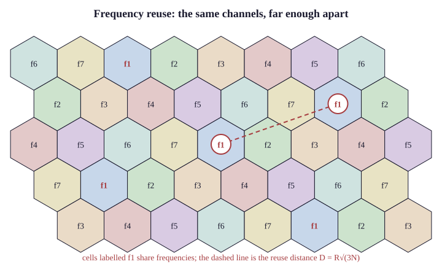

# 46.1 The Cellular Idea

In December 1947, Douglas Ring at Bell Labs wrote an internal memorandum proposing a mobile
telephone system built from small hexagonal service areas with reused frequencies.

The idea was complete. The technology to build it did not exist for another thirty
years — and the gap is instructive, because what was missing was not radio but
**computation.**

## The problem

Mobile radio before cellular used one powerful transmitter covering a whole city.

**Bell's Mobile Telephone Service, from 1946:**

| | |
|---|---|
| Coverage | one high-power transmitter, city-wide |
| **Channels** | **a few dozen** |
| **Simultaneous calls** | **as many as there were channels** |
| Users in New York, 1976 | **545 subscribers, 3,700 on the waiting list** |
| Typical wait for a channel | **20–30 minutes** |

**The constraint is arithmetic.** One transmitter means one set of frequencies, used once
across the entire city — so the system's capacity is the channel count, permanently,
regardless of demand.

> **Adding subscribers does not add capacity. It adds queueing.**

## The insight

Ring's proposal inverts the design: many low-power transmitters instead of one powerful
one.

```
   One big cell:                    Many small cells:

   ┌─────────────────────┐          ○ ○ ○ ○ ○
   │                     │         ○ ○ ○ ○ ○ ○
   │    56 channels      │          ○ ○ ○ ○ ○
   │    for the city     │         ○ ○ ○ ○ ○ ○
   │                     │          ○ ○ ○ ○ ○
   └─────────────────────┘
                                    each cell: 8 channels
   56 simultaneous calls            28 cells × 8 = 224 calls
```

Because a low-power transmitter's signal falls away (Chapter 42 §42.3), the same
frequency can be used again a few cells away without interference.

> Frequency reuse converts a fixed capacity into one that grows with the number of
> cells — and the number of cells is a matter of how much you are willing to build.

And capacity can be increased indefinitely by making cells smaller, which is the property
that made mobile telephony possible at scale. **Cell splitting** — dividing a congested cell
into several smaller ones — is how capacity is added in practice, and it is exactly Chapter 45
§45.3's argument arrived at three decades earlier.

## Why hexagons

**A modelling convenience, not a physical fact.** Real coverage is irregular (Chapter 42
§42.4).

But hexagons tile the plane with no gaps or overlaps, and they are the closest regular
tiling to a circle — so they model "equal-radius coverage areas packed efficiently" with the
least distortion. Squares waste corners; triangles are worse.

## The reuse pattern

**The arithmetic that determines capacity.**

A reuse factor *N* means the available channels are divided into *N* groups, and each
cell uses one group. A cell may reuse a group when it is far enough away that the
interference is tolerable.

```
   N = 7 reuse:

         3   4
       2   1   5
         7   6
             3   4
           2   1   5      ← channel group 1 reused
             7   6
```

**Valid patterns satisfy:**

$$N = i^2 + ij + j^2 \qquad i, j \geq 0$$

giving N = 1, 3, 4, 7, 9, 12, 13, 19… — the numbers for which hexagons tile consistently.

**And the reuse distance:**

$$\frac{D}{R} = \sqrt{3N}$$

where *D* is the distance between co-channel cells and *R* the cell radius.

{width=88%}

| N | D/R | Channels per cell (of 336) | Interference |
|---|---|---|---|
| **3** | 3.0 | **112** | **high** |
| **4** | 3.5 | 84 | high |
| **7** | **4.6** | **48** | **acceptable — the classic choice** |
| 12 | 6.0 | 28 | low |
| 19 | 7.5 | 18 | very low |

> The trade is exact: a smaller reuse factor gives more channels per cell and more
> co-channel interference. N = 7 was the classic analogue compromise.

And modern systems use N = 1 — every cell on every frequency — because CDMA and OFDMA
tolerate co-channel interference in ways analogue FM could not. §46.3 covers how.

## Handover

The mechanism that makes mobility work, and the thing that needed computers.

As a subscriber moves from one cell to another, the call must transfer — a new frequency
in the new cell, coordinated so the conversation is not interrupted.

Which requires, continuously and for every active call:

- **measuring signal strength** at several base stations
- **deciding** when to hand over and to which cell
- **allocating** a channel in the target cell
- **switching** the call, in under a few hundred milliseconds
- doing it for thousands of calls at once

This is why the idea waited thirty years. In 1947 the measurement, the decision logic and
the switching all had to be done by relays and human operators, and there is no number of
operators that can do it.

The first commercial cellular systems appeared in 1979 (NTT, Tokyo) and 1983 (AMPS,
Chicago) — when a computer could be put in a switching centre and asked to make those
decisions in real time.

> The cellular idea was a computing problem wearing a radio problem's clothes, and this
> is a recurring shape: Chapter 31's routing protocols and Chapter 45 §45.2's roaming
> coordination are the same observation at different scales.

### Hard and soft

| | Mechanism | Used by |
|---|---|---|
| **Hard handover** | **break the old connection, then make the new** | GSM, LTE, 5G |
| **Soft handover** | **connect to both, then release the old** | CDMA (3G) |

**"Break before make" versus "make before break".**

Soft handover is more robust — the call is never without a connection — and it requires
that both cells use the same frequency, which only CDMA's N = 1 reuse permits.

LTE and 5G returned to hard handover because their handover is fast enough (tens of
milliseconds) that the break is imperceptible, and because soft handover consumes resources
in two cells simultaneously.

## Cell sizes

The same coverage-versus-capacity trade as Chapter 45 §45.3, at a different scale:

| Cell type | Radius | Where |
|---|---|---|
| **Macrocell** | **1–30 km** | rural coverage, general |
| **Microcell** | 200 m – 2 km | urban |
| **Picocell** | 10–200 m | inside buildings, stations |
| **Femtocell** | **10–50 m** | homes, small offices |
| **mmWave small cell** | **50–200 m** | 5G high-band (§46.4) |

And the pattern of deployment is to overlay rather than replace: macrocells provide
continuous coverage, and small cells are added where capacity is needed — a stadium, a
station concourse, a business district.

Which is exactly Chapter 45 §45.3's capacity design, and it is why 5G's small cells are a
capacity strategy rather than a coverage one.

## What it produced

**The arithmetic that follows from frequency reuse:**

| | 1976 (pre-cellular, New York) | Now |
|---|---|---|
| Simultaneous users | **~12** | **millions** |
| Subscribers | 545 | ~8 billion connections worldwide |

Not from more spectrum — spectrum grew by perhaps an order of magnitude. From reusing
it, and from reusing it more densely.

> Every subsequent generation has increased capacity by three mechanisms: more spectrum,
> better modulation, and smaller cells — and the third has contributed the most.

## What breaks here

**Capacity problems in a dense area.** The cell is too large. **Cell splitting** — the answer
in 1947 and still the answer.

**Dropped calls at cell boundaries.** Handover failing — signal, timing, or capacity in the
target cell.

**Coverage without capacity.** A macrocell covers a stadium and cannot serve it. Small cells.

**Interference between distant cells.** Reuse distance too small, or unusual propagation
(ducting over water carries signals far beyond the design range).

> **Network+ note.** Objective 2.4 touches cellular lightly. Over-learn: cellular works by
> frequency reuse across many small cells; **capacity is increased by making cells smaller**;
> and **handover transfers a call between cells.** The frequency-reuse concept is the
> examinable content.
