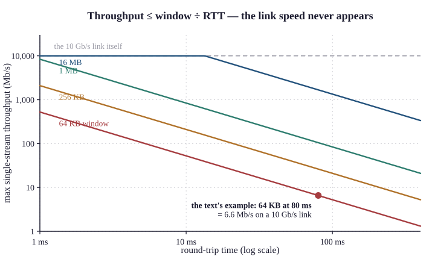

# 66.1 Separating Bandwidth, Latency and Loss

"It's slow" is the least informative report a network engineer receives, and it is the most
common.

The first job is not to diagnose. It is to determine which of three independent quantities is
actually wrong, because they have different causes, different measurements and different
fixes — and the reflexive response of adding bandwidth addresses only one of them.

## The three quantities

| | Is | Measured by | Fixed by |
|---|---|---|---|
| **Bandwidth** | **how much per second** | **`iperf3`, interface counters** | **more capacity, or QoS** |
| **Latency** | **how long one way** | **`ping`, `mtr`** | **distance, queueing, or nothing** |
| **Loss** | **what fraction is discarded** | **`mtr`, `iperf3 -u`, interface counters** | **the cause, which is never "more bandwidth"** |

**And the crucial property:**

> **They are independent.** A link can have enormous bandwidth and terrible latency (a
> satellite, Chapter 49 §49.4), low latency and no bandwidth (a congested LAN), or plenty of
> both and 2% loss that destroys everything.

Chapter 3 §3.1 decomposed delay into four components, and the decomposition determines what
can be done:

| Component | Cause | Can you fix it? |
|---|---|---|
| **Propagation** | **distance ÷ speed of light** | **no — only shorten the path** (Chapter 52 §52.4) |
| **Serialisation** | **bytes ÷ link rate** | **yes — a faster link** |
| **Queueing** | **congestion** | **yes — capacity, QoS, or AQM** (Chapter 52) |
| **Processing** | **the device** | rarely significant, and occasionally decisive |

## The questions that separate them

**Six, and each takes under a minute.**

| | Question | If yes |
|---|---|---|
| **1** | **Is a large file transfer slow?** | **bandwidth or loss** |
| **2** | **Is an interactive session laggy?** | **latency or jitter** |
| **3** | **Do small requests take a long time to start?** | **latency, or DNS, or a timeout** |
| **4** | **Is it slow for everyone, or one person?** | **Chapter 63 §63.1's scope question** |
| **5** | **Is it slow all the time, or at certain hours?** | **congestion** if the latter |
| **6** | **Is it slow to everything, or to one destination?** | **the path**, if the latter |

**And the two measurements that follow:**

```
   $ ping -c 100 <destination>          # latency, jitter, loss — 100 seconds
   $ iperf3 -c <server> -t 30 -P 8      # bandwidth, both directions
   $ iperf3 -c <server> -t 30 -P 8 -R
```

> **Run the ping while the throughput test is running.** Latency measured on an idle link
> tells you the propagation; latency measured under load tells you the queueing — and the
> difference between the two is the most informative measurement in this chapter
> (§66.4).

## The bandwidth trap

Bandwidth is the quantity people reach for and it is frequently not the constraint.

Four reasons a fast link delivers slow transfers:

The window, not the link (Chapter 3 §3.4, Chapter 64 §64.4).

$$\text{single-stream throughput} \le \frac{\text{window}}{\text{RTT}}$$

A 64 KB window on an 80 ms path gives 6.6 Mb/s on a 10 Gb/s link. Adding bandwidth changes
nothing.

{width=90%}

Loss, and the Mathis relationship (Chapter 38 §38.2):

$$\text{throughput} \approx \frac{\mathrm{MSS} \times C}{\mathrm{RTT}\sqrt{p}}, \qquad C = \sqrt{3/2}$$

| Loss | **RTT 20 ms** | **RTT 80 ms** |
|---|---|---|
| **0.0001%** | 715 Mb/s | 179 Mb/s |
| **0.001%** | 226 Mb/s | 57 Mb/s |
| **0.01%** | **72 Mb/s** | **18 Mb/s** |
| **0.1%** | **23 Mb/s** | **5.7 Mb/s** |
| **1%** | **7.2 Mb/s** | **1.8 Mb/s** |

> 0.1% loss caps a single TCP stream at 23 Mb/s on a 20 ms path, regardless of whether the
> link is 100 Mb/s or 100 Gb/s. This is the arithmetic that explains most "we upgraded the
> circuit and nothing improved" reports.

**The endpoint.** A laptop's CPU, its disk, a virtual machine's vNIC, an application's own
threading. Test between two other machines on the same path to eliminate it (Chapter 64
§64.4).

**And the application.** A protocol that performs many sequential round trips is bounded by
latency and not by bandwidth at all — and Chapter 52 §52.4's argument applies: a 166 ms
round trip and twelve sequential requests is two seconds before anything renders.

## Where the time actually goes

A method for a single slow transaction, and it converts an opinion into a decomposition.

```
   $ curl -w '@format' -o /dev/null -s https://app.example.com/

   dns_lookup:     0.004
   tcp_connect:    0.083      ← one RTT
   tls_handshake:  0.171      ← two more RTTs
   ttfb:           2.884      ← the server took 2.6 seconds
   total:          2.961
```

Which localises the delay to one of five places in one command:

| Large value | Cause |
|---|---|
| **`dns_lookup`** | **DNS** (Chapter 65 §65.4) |
| **`tcp_connect`** | **RTT, or a retransmitted SYN** |
| **`tls_handshake`** | **RTT × 2, or an OCSP lookup, or a slow server** |
| **`ttfb` minus the handshake** | **the server's processing time** |
| **`total` minus `ttfb`** | **the transfer — bandwidth or loss** |

> This is the most useful command in this chapter for a web complaint, and it takes
> five seconds. A `ttfb` of 2.9 seconds with an 83 ms connect time is a server problem, stated
> as a measurement.

## Latency, and what is irreducible

Chapter 3's argument, restated because it settles arguments.

| Path | **Typical observed round trip** |
|---|---|
| Same building | **< 1 ms** |
| Same city | **1–3 ms** |
| **London – Frankfurt** | **~12 ms** |
| **London – New York** | **~65 ms** (Chapter 50 §50.5) |
| **London – Singapore** | **~147 ms** |
| **GEO satellite** | **477 ms** (Chapter 49 §49.4) |

These are observed figures; the pure propagation minimum is lower — London to Frankfurt is
about 6 ms of light in glass and about 12 ms in practice, because the fibre route is longer than
the great circle and each device adds a little (Chapter 50 §50.5).

> No equipment, no protocol and no amount of money reduces the propagation component. A user in Singapore
> accessing a server in London will experience 147 ms of round trip, and the only remedy is to
> move the server (Chapter 52 §52.4).

Which makes the first latency question: is this figure close to the propagation minimum?

If it is, the network is doing everything it can. If it is three times the minimum, the
excess is queueing or a path that is not the direct one, and both are diagnosable.

## Jitter

Variation in latency, and it matters far more than the average for real-time traffic
(Chapter 3 §3.3).

```
   rtt min/avg/max/mdev = 8.1/9.2/11.4/0.6 ms      ← healthy
   rtt min/avg/max/mdev = 8.1/47.2/380/91.4 ms     ← the average is meaningless
```

> **The second line's average of 47 ms would satisfy any threshold.** Its maximum of 380 ms
> and its deviation of 91 ms make voice unusable, and a monitoring system reporting only the
> average shows nothing wrong.

Chapter 54 §54.1's percentile argument, in its most concrete form: for anything
interactive, measure p95 and p99, and set the alert on those.

## The report-to-measurement table

What to measure, given what the user said.

| User says | Measure |
|---|---|
| **"Downloads are slow"** | **`iperf3` both directions; loss; the window** |
| **"The website is slow"** | **`curl -w`** — and it is frequently the server |
| **"Calls break up"** | **jitter and loss, not bandwidth** (Chapter 52 §52.1) |
| **"Everything is slow"** | **scope first** (Chapter 63 §63.1), then the link's utilisation |
| **"It's slow at 4 p.m."** | **congestion — and the graph's averaging interval** (Chapter 54 §54.1) |
| **"Slow since Tuesday"** | **what changed** (Chapter 55) |
| **"Slow from home"** | **their access link, their Wi-Fi, or the VPN** (Chapter 61 §61.4) |
| **"Slow to one application only"** | **not the network** — but prove it (Chapter 65 §65.4) |

## What breaks here

**A circuit upgraded and nothing improved.** The constraint was loss, latency or the window.
The Mathis table is the argument.

A 10 Gb/s link delivering 6 Mb/s to one transfer. The window and the RTT. Not a fault.

A five-minute utilisation graph showing 40% and users complaining. **Microbursts** (Chapter
54 §54.1). Check the discard counter.

**Latency that looks fine on average.** Read the maximum and the deviation. For voice, the
average is the wrong statistic.

"The network is slow" and `curl -w` showing 2.9 seconds of `ttfb`. **The server.** Present it
as a timestamp (Chapter 65 §65.4).

**A throughput test limited by the laptop.** Test between two other machines.

Users in Singapore complaining about a London application. 147 ms is physics. Move the
content, or accept it.

**Bandwidth added to fix a latency complaint.** **Two different quantities.** This chapter exists
to prevent it.

> **Network+ note.** Objective 5.4 covers performance issues. Over-learn: bandwidth, latency,
> jitter and packet loss are distinct metrics; latency is delay and jitter is variation in
> delay; voice and video are sensitive to latency and jitter, bulk transfer to bandwidth and
> loss; and **a baseline is required to identify degradation.** The metric-to-symptom mapping
> is examined and the independence of the three is the idea worth carrying.
