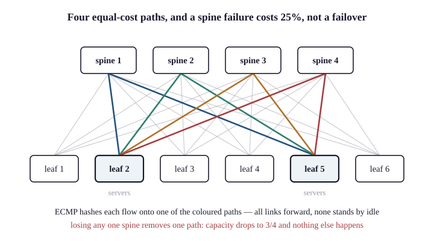

# 67.4 Leaf–Spine Data Centre Fabrics

The topology the rest of this chapter is built on, and its logic is straightforward once the
problem is stated.

## The problem with three tiers

Chapter 11 §11.4's access/distribution/core design optimises for north–south traffic — a
user outside requests, a server inside responds — with capacity concentrated towards the
core.

**East–west traffic breaks it in two ways:**

```
   Three-tier:                       Two servers in adjacent racks:

        [ Core ]                     Server A → access → distribution → core
        /      \                              → distribution → access → Server B
   [Dist]      [Dist]                
    /  \        /  \                 Six hops, through the most contended devices,
 [Acc][Acc]  [Acc][Acc]              for traffic that never leaves the building.
```

And spanning tree blocks half the links (Chapter 19) **to prevent loops**, so the
redundancy that was purchased carries nothing until something fails.

> The topology was optimised for a traffic pattern that no longer existed, and **half the
> capacity was idle by design.**

## Leaf–spine

Every leaf connects to every spine. Nothing connects leaf to leaf or spine to spine.

```
              ┌────────┐  ┌────────┐  ┌────────┐  ┌────────┐
              │ Spine1 │  │ Spine2 │  │ Spine3 │  │ Spine4 │
              └───┬────┘  └───┬────┘  └───┬────┘  └───┬────┘
         ┌────────┼───────────┼───────────┼───────────┼────────┐
         │        │           │           │           │        │
      ┌──┴──┐  ┌──┴──┐     ┌──┴──┐     ┌──┴──┐     ┌──┴──┐  ┌──┴──┐
      │Leaf1│  │Leaf2│     │Leaf3│     │Leaf4│     │Leaf5│  │Leaf6│
      └──┬──┘  └──┬──┘     └──┬──┘     └──┬──┘     └──┬──┘  └──┬──┘
       servers  servers    servers     servers     servers  servers
```

**And the properties follow directly:**

| Property | Because |
|---|---|
| **Every server is exactly two hops from every other** | **up to a spine, down to a leaf** |
| **Latency is uniform and predictable** | **the path length is always the same** |
| **All links forward** | **the fabric is routed; ECMP, not spanning tree** |
| **Capacity scales by adding spines** | **each new spine adds an uplink to every leaf** |
| **Server capacity scales by adding leaves** | **each new leaf connects to every spine** |
| **A spine failure costs $1/n$ of the capacity** | **not a failover; a reduction** |

> **The last row is the underrated one.** In a three-tier design a distribution switch failure
> halves the capacity of everything below it. In a fabric with eight spines, losing one costs
> 12.5% of the bisection bandwidth and nothing else — no failover, no reconvergence beyond
> ECMP dropping a next hop, and no outage.

{width=95%}

## Routed to the leaf

The critical design change, and it is what makes the rest possible.

> **Layer 3 all the way to the leaf.** Each rack is its own subnet; the leaf is its gateway;
> the fabric routes.

| Consequence | |
|---|---|
| **No spanning tree** | **there are no Layer 2 loops to prevent** |
| **ECMP across every spine** | **all links used** (Chapter 29 §29.3) |
| **Failure domains are one rack** | **a broadcast storm cannot leave a leaf** |
| **Convergence is a routing protocol's** | **sub-second, and it is a well-understood mechanism** |
| **And VM mobility breaks** | **which §67.2 and §67.3 exist to fix** |

The routing protocol is BGP, almost universally, and the reason is not the one people
expect.

BGP was chosen for data centre fabrics — RFC 7938 documents the practice — not because it
is a better IGP but because it is explicitly configured.

> An IGP floods and computes; every router in an area sees the whole topology and reacts to
> every change. BGP advertises what it is told to advertise, to whom it is told, and its
> policy is explicit. In a fabric with hundreds of switches, "nothing happens unless
> configured" is a feature.

And the deployment is unusual by Internet standards: eBGP between every leaf and every
spine, with a private AS number per leaf, no IGP at all, and the entire underlay is a
few lines of configuration per switch generated by a template (Chapter 70).

## The oversubscription arithmetic

The number that determines whether a fabric performs, and it is simple.

$$\text{oversubscription} = \frac{\text{server-facing capacity}}{\text{uplink capacity}}$$

| Leaf configuration | Down | Up | **Ratio** |
|---|---|---|---|
| 48 × 25G, 6 × 100G | 1,200 G | 600 G | **2:1** |
| 48 × 10G, 4 × 40G | 480 G | 160 G | **3:1** |
| **32 × 100G, 8 × 400G** | **3,200 G** | **3,200 G** | **1:1 — non-blocking** |
| 48 × 25G, 8 × 100G | 1,200 G | 800 G | **1.5:1** |

And what ratio is appropriate depends entirely on the workload:

| Workload | Ratio |
|---|---|
| **General virtualisation** | **3:1 is common and adequate** |
| **Web and application tiers** | 2:1 |
| **Storage, big data, HPC** | **1:1, or close** |
| **AI training clusters** | **1:1, and increasingly a separate dedicated fabric** |

> **A 3:1 ratio is not "the fabric is a third as fast".** It means that if every server
> transmitted at line rate simultaneously to a server in a different rack, a third of the
> traffic would fit. **Which they do not** — Chapter 9's statistical multiplexing — and the
> question is what your traffic actually does, which requires measurement (Chapter 54 §54.1)
> rather than assumption.

## Scaling, and where it stops

The fabric's size is bounded by the spine's port count.

$$\text{maximum leaves} = \text{ports per spine}$$

| Spine | Leaves | **Servers, at 48 ports each** |
|---|---|---|
| 32 × 400G | 32 | 1,536 |
| **64 × 400G** | **64** | **3,072** |
| 128 × 400G | 128 | **6,144** |

Beyond that, a third tier — a super-spine, or a five-stage Clos:

```
        [ Super-spine ]  [ Super-spine ]
             │    │           │    │
        ┌────┴────┴───┐  ┌────┴────┴───┐
        │   POD 1     │  │   POD 2     │      each POD is a leaf-spine fabric
        │ spines+leaves│  │ spines+leaves│
        └─────────────┘  └─────────────┘
```

Which adds two hops between pods and keeps two hops within one — so workload placement
becomes a performance consideration, and the scheduler should know about it.

> The design is Charles Clos's 1953 telephone switching network (§67's reading), and the
> mathematics is his: a three-stage network can be non-blocking with far fewer crosspoints than
> a full crossbar. A telephone exchange design from 1953 is the standard data centre
> topology, which is a satisfying recurrence.

## Cabling and the physical reality

The property that surprises people who have only seen three-tier designs.

A 64-leaf, 8-spine fabric has 512 fabric cables — every leaf to every spine — and they
are all long, because the spines are in a different row.

| | |
|---|---|
| **Cable count** | **leaves × spines** |
| **Structured cabling** | **essential** — Chapter 53 §53.2's labelling is not optional at this scale |
| **Optics cost** | **frequently exceeds the switch cost** |
| **Break-out cables** | **one 400G port to four 100G** — the standard economy |
| **Row placement** | **spines central, to equalise cable lengths** |

**And the optics are the budget.** At 400G, transceivers can cost more than the switch ports
they occupy, which makes the choice of reach — DAC, AOC, SR, DR, FR — a genuine engineering
decision rather than an afterthought (Chapter 10, Chapter 50 §50.3).

## When a fabric is the wrong answer

Honesty, because leaf–spine is proposed reflexively for any data centre.

| Fabric is right | Fabric is overkill |
|---|---|
| **Substantial east–west traffic** | **a dozen servers in two racks** |
| **More than a few racks** | |
| **Predictable latency required** | **north–south dominant** |
| **Growth expected** | **a static environment** |
| **Multi-tenancy** | **one tenant, few segments** |

> A two-rack environment with forty servers does not need a fabric, an overlay or a BGP
> underlay. Two switches, a few VLANs and a router is correct, and building the
> architecture in this chapter for it produces complexity with no benefit — which is
> Chapter 72's argument and the most common design error in this field.

## What breaks here

**Uneven load across spines.** **ECMP hashing** — check what the hash includes (Chapter 29
§29.3), and whether the VXLAN source port is being varied (§67.2).

A performance problem that appears only between certain racks. **Oversubscription**, or a
failed uplink reducing that leaf's capacity.

Capacity loss after a spine failure that is worse than $1/n$. The leaves' uplinks were not
evenly distributed, or ECMP is not rebalancing.

Latency that varies by which server pair is measured. A pod boundary in a five-stage
fabric, or a workload placed badly.

**A fabric built for two racks.** Complexity with no benefit.

**Cabling errors at commissioning.** **512 identical cables** — Chapter 53 §53.2's labelling and
LLDP-based verification are how this is caught before it is production.

**Optics budget exceeding the switch budget.** **Expected at 400G.** It should be in the design.

> **Network+ note.** Objective 1.6 covers data centre architecture. Over-learn: spine and leaf
> is the modern data centre topology; every leaf connects to every spine and none to each
> other; **it provides consistent latency and uses all links**; east–west traffic is between
> servers and north–south between users and servers; and **three-tier is the older
> hierarchical model.** The spine-leaf definition and the east–west/north–south distinction are
> both examined.
